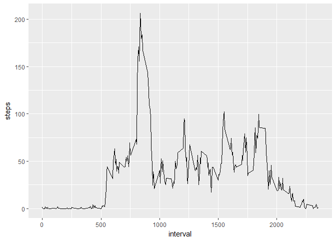

# Reproducible Research: Peer Assessment 1


## Loading and preprocessing the data


```r
track_data <- read.csv("activity.csv", header = T, sep = ",", colClasses = c("integer", "Date", "integer"))
```

## What is mean total number of steps taken per day?


```r
library(ggplot2)

track_data_day <- split(track_data, track_data$date)
daily_steps <- sapply(track_data_day, function(x) sum(x$steps))

qplot(daily_steps, geom = "histogram", binwidth = 800, ylim = c(0,20))
```

```
## Warning: Removed 8 rows containing non-finite values (stat_bin).
```

<!-- -->

```r
mean_steps <- mean(daily_steps, na.rm = T)
median_steps <- median(daily_steps, na.rm = T)
```

The mean total number of steps is 10766, the median is 10765


## What is the average daily activity pattern?


```r
track_data_interval <- split(track_data, track_data$interval)
interval_steps <- sapply(track_data_interval, function(x) mean(x$steps, na.rm = T))
qplot(as.integer(names(interval_steps)), interval_steps, geom = "line", xlab = "interval", ylab = "steps")
```

<!-- -->

```r
max_interval <- names(which.max(interval_steps))
```
The interval containing the maximum number of steps on average is interval number 835

## Imputing missing values


```r
total_NA <- sum(is.na(track_data$steps))
index_NA <- which(is.na(track_data$steps))
filled_track_data <- track_data
for (i in index_NA){
        filled_track_data$steps[i] <- floor(interval_steps[as.character(track_data$interval[i])])
}
```
There is a total of 2304 NAs in the original dataset. We chose to replace the NAs with
the mean value over the days for the particular interval


```r
filled_track_data_day <- split(filled_track_data, filled_track_data$date)
filled_daily_steps <- sapply(filled_track_data_day, function(x) sum(x$steps))

qplot(filled_daily_steps, geom = "histogram", binwidth = 800, ylim = c(0,20))
```

<!-- -->

```r
filled_mean_steps <- mean(filled_daily_steps, na.rm = T)
filled_median_steps <- median(filled_daily_steps, na.rm = T)
```
The corrected mean total number of steps is 10749, the median is 10641

## Are there differences in activity patterns between weekdays and weekends?

```r
filled_track_data$daytype <- ifelse(weekdays(filled_track_data$date) %in% c("lördag", "söndag"), "weekend", "weekday")
weekday_data <- subset(filled_track_data, daytype == "weekday")
weekend_data <- subset(filled_track_data, daytype == "weekend")

weekday_data_interval <- split(weekday_data, weekday_data$interval)
weekday_interval_steps <- sapply(weekday_data_interval, function(x) mean(x$steps, na.rm = T))

weekend_data_interval <- split(weekend_data, weekend_data$interval)
weekend_interval_steps <- sapply(weekend_data_interval, function(x) mean(x$steps, na.rm = T))

qplot(as.integer(names(weekday_interval_steps)), weekday_interval_steps, geom = "line", xlab = "interval", ylab = "steps", main = "weekdays")
```

<!-- -->

```r
qplot(as.integer(names(weekend_interval_steps)), weekend_interval_steps, geom = "line", xlab = "interval", ylab = "steps", main = "weekends")
```

<!-- -->


